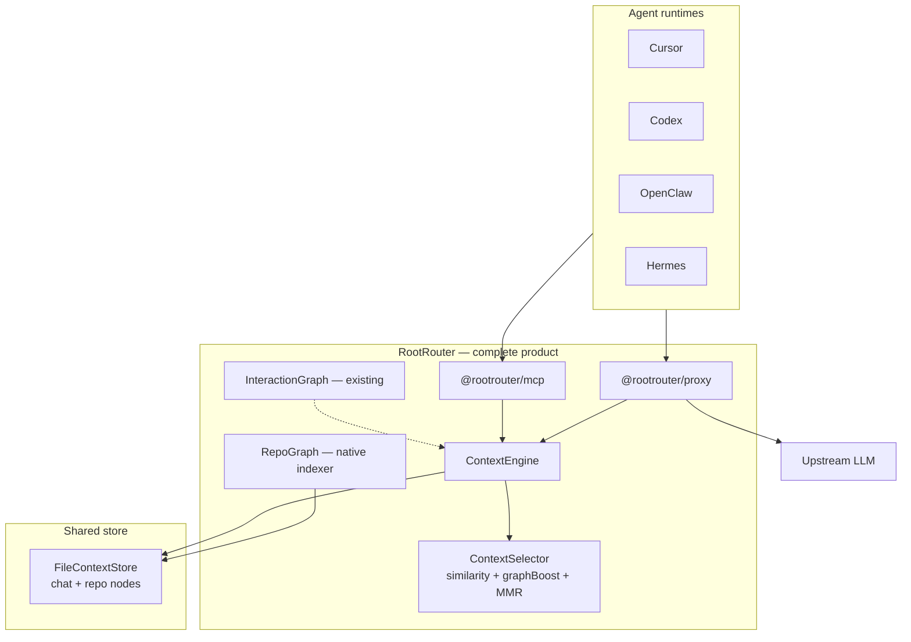

# RootRouter — Next Steps

Roadmap after `selectContext`, MCP, and the transparent proxy. RootRouter is a **complete standalone product**: native repo knowledge graph, unified runtime memory, and transparent token budgeting — inspired by fundamentals from tools like [Graphify](https://graphify.net/), but **no Graphify dependency**.

---

## Product vision (end state)

When all phases are complete, an agent developer:

1. Points `base_url` at `rootrouter-proxy` (or adds MCP for explicit control).
2. Runs `rootrouter index ./repo` once per codebase (optional but recommended for coding agents).
3. Never thinks about prompt stuffing again.

RootRouter automatically:

- Trims live chat history every LLM call (proxy).
- Recalls relevant prior turns across sessions (stateful store).
- Pulls relevant **files and symbols** from a native **RepoGraph** (not external tools).
- Enforces a token budget with MMR dedup.
- Optionally logs savings to telemetry / dashboard.



**North star:** sessions that would send 50k+ tokens routinely send 5–15k of *relevant* context — repo structure + conversation — with **only** a `base_url` change.

---

## Where we are now

| Surface | What it does | Agent awareness |
|---------|----------------|-----------------|
| `selectContext` / `ContextEngine` | Query-aware similarity + MMR within a token budget | Code import |
| `@rootrouter/mcp` | `record_context`, `select_context`, `stats` over a file-backed store | Agent must call tools |
| `@rootrouter/proxy` | Trims `messages[]` on every `/chat/completions` before upstream | **None** (transparent) |

**Main gap (P0):** the proxy is stateless per request — it only selects among turns in the HTTP body, not cross-session memory.

**Secondary gap (P2):** no native **repo structure graph** — TF-IDF on text misses import/call relationships.

---

## Graphify — design reference only

[Graphify](https://graphify.net/) is useful **research**, not a dependency. It validates the market (71.5× token reduction on subgraph vs naive corpus for repo queries) and teaches patterns we model natively:

| Graphify fundamental | RootRouter native equivalent |
|---------------------|------------------------------|
| Static repo graph (AST, imports) | **`RepoGraph`** — Phase 2 |
| Leiden communities | Community tags on nodes + MMR diversity (start with directory/components) |
| God nodes / hub symbols | `degree` boost in `graphBoost` |
| BFS subgraph query | Seed by similarity → expand 1–2 hops via `metadata.edges` |
| Cached semantic summaries | Optional per-file summary on index (no raw code in embed API) |
| Incremental cache / watch | File watcher → re-chunk → upsert store |
| Secure ingest | Path containment, max file size on `index_repo` |

**We do not:** ship Graphify, require `pip install graphifyy`, or import `graph.json` as the primary path (optional interoperability later).

### Three graph layers (RootRouter moat)

| Layer | Module | Domain |
|-------|--------|--------|
| **RepoGraph** (new) | `packages/sdk/src/repo/` | What the codebase **is** — files, symbols, imports |
| **InteractionGraph** (existing) | `packages/sdk/src/core/graph.ts` | What agents **did** — turns, topics, chambers |
| **AgentTopologyGraph** (existing) | `packages/sdk/src/core/agentGraph.ts` | How agents **delegate** |

Only RootRouter unifies all three under one `ContextEngine` store and one selection budget per LLM call.

---

## Phase 1 — Stateful proxy (P0) ← **in progress**

**Goal:** Proxy remembers context across requests without the agent calling MCP tools.

### 1.1 Shared `ContextEngine` in the proxy process

- [x] Hold a `FileContextStore` in the proxy (env: `ROOTROUTER_STORE_PATH`).
- [x] On each `/chat/completions`, upsert prior `user`/`assistant` string turns into the store.
- [x] Merge **stored** candidates with in-request turns; select with split budget (`ROOTROUTER_STORE_SHARE`, default 0.5).
- [x] Inject selected store turns into the prompt (not only filter in-request).
- [x] `x-rootrouter-agent-id` header for multi-agent scoping.
- [x] Persist store after each request.

### 1.2 Prompt assembly policy

- [x] Always keep: system, tool, multimodal, final user turn.
- [x] Middle: selected mix of in-request history + store hits, sorted by time/index.
- [x] Store vs in-request budget split (default 50/50 of `contextBudget`).

### 1.3 Tests

- [x] Unit: stateful filter retrieves store context when request is short.
- [x] E2E: two-request session; request 2 recalls relevant turn from request 1.
- [x] E2E: `x-rootrouter-agent-id` isolation.

**Outcome:** True "walk away" UX for chat-heavy agents — proxy only, no MCP discipline required.

---

## Phase 2 — Native RepoGraph (repo-aware context)

**Goal:** Coding agents get structural context from a **built-in indexer** — complete product, no Graphify.

### 2.1 `RepoGraph` module (`packages/sdk/src/repo/`)

- [x] `indexRepo(rootPath, options)` — walk repo, chunk files, extract edges.
- [x] **MVP edges:** `imports` (TS/JS/Python import parsing), `same_directory`.
- [x] **MVP nodes:** file chunks as `ContextItem` with `metadata: { path, language, edges[], community?, degree? }`.
- [x] Communities: directory-based (Leiden later if needed).
- [x] Hub detection: degree centrality → `metadata.degree` for god-node boost.
- [x] Security: path containment (jail to repo root), max file size, ignore `node_modules`/`.git`.

### 2.2 Ingest surfaces

- [x] CLI: `rootrouter index ./repo` (or `npm run index -w rootrouter -- ./path`).
- [x] MCP tool: `index_repo` → upsert into shared store.
- [x] Proxy env: `ROOTROUTER_REPO_PATH` → auto-index on startup (optional).

### 2.3 `graphBoost` in `ContextSelector`

- [x] Seed: top-k items by query similarity.
- [x] Expand: 1-hop neighbors via `metadata.edges`.
- [x] Boost: hub nodes + expanded neighbors (same pattern as `chamberBoost`).
- [x] Community cap: prefer at most N items per `metadata.community` in MMR pass.

### 2.4 Bridge runtime ↔ repo (RootRouter-only)

- [x] When proxy records a turn, tag `metadata.filesMentioned` if paths appear in text.
- [ ] Strengthen `turn → file` edges in store metadata over time.
- [ ] Optional: chamber id from `InteractionGraph` boosts repo nodes in same chamber region.

**Outcome:** `npm install rootrouter` + `index` + `proxy` = full coding-agent context stack.

### 2.5 Deferred (not MVP)

- Call graph via Tree-sitter / `ts-morph`.
- PDF, diagram, vision ingest.
- Leiden clustering in TypeScript.
- Optional **Graphify import adapter** for users who already have `graph.json` (interop only).

---

## Phase 3 — Selection quality and scale

### 3.1 Embeddings

- [x] Embedding cache (content-hash keyed) in `ContextEngine` / proxy.
- [x] Optional local model provider (ONNX `bge-small` / MiniLM) behind `EmbeddingProvider`.
- [x] Wire `EMBEDDING_API_KEY` in proxy (parity with MCP).

### 3.2 Indexing

- [x] ANN index (HNSW) when `store.size > N` (e.g. 500).
- [x] Eviction: LRU by last-selected timestamp beyond `maxItems`.

### 3.3 Honest metrics

- [x] Recall proxy: log dropped message ids; optional thumbs-down hook.
- [x] Realistic savings baseline (window of last N turns, not lifetime store).

---

## Phase 4 — Packaging and agentic UX

### 4.1 npm surface

- [ ] Publish `rootrouter`, `@rootrouter/proxy`, `@rootrouter/mcp`.
- [ ] One-liner:
  ```bash
  npm install rootrouter
  npx rootrouter-proxy
  npx rootrouter-mcp
  npx rootrouter index ./my-repo
  ```

### 4.2 Agent presets

- [ ] `rootrouter init cursor` — `.cursor/mcp.json` + proxy snippet.
- [ ] `rootrouter init codex` — `~/.codex/config.toml` fragment.

### 4.3 Dashboard

- [ ] `selectionStats` in Convex snapshots (tokens saved per session).
- [ ] Topology view: RepoGraph communities + chambers overlay.

---

## Execution order

| Priority | Work item | Agent UX impact |
|----------|-----------|-----------------|
| **P0** | Stateful proxy (Phase 1) | Highest — zero agent changes |
| **P1** | Embedding cache + proxy env parity | Better relevance |
| **P2** | Native RepoGraph + graphBoost (Phase 2) | Coding-agent quality — **done (MVP)** |
| **P3** | ANN index + recall metrics (Phase 3) | Scale + trust |
| **P4** | `rootrouter init` + publish (Phase 4) | Distribution |

---

## Decision log

| Question | Decision |
|----------|----------|
| Use Graphify at runtime? | **No** — design reference only |
| Build native repo knowledge graph? | **Yes** — `RepoGraph` in Phase 2 |
| Model Graphify concepts into RootRouter? | **Yes** — subgraph boost, hubs, communities, secure ingest |
| Quote Graphify CLI/MCP? | **No** (optional `graph.json` import later for interop) |
| Replace InteractionGraph with RepoGraph? | **No** — complementary layers |
| Proxy vs MCP primary? | **Proxy primary**; MCP for explicit control + `index_repo` |

---

## Open questions

1. **RepoGraph MVP languages** — TS/JS first, then Python? Confirm before Phase 2.
2. **Auto-index on proxy start** — `ROOTROUTER_REPO_PATH` vs explicit `index` command.
3. **Celo telemetry for selection** — on-chain `tokensSaved` from proxy, or off-chain only for v0.2?
4. **Monorepo publish** — single `rootrouter` meta-package vs separate scoped packages.

---

## References

- [Graphify](https://graphify.net/) — design reference (not a dependency)
- RootRouter MCP: [`packages/mcp/README.md`](../packages/mcp/README.md)
- RootRouter proxy: [`packages/proxy/README.md`](../packages/proxy/README.md)
- Interaction graph: [`packages/sdk/src/core/graph.ts`](../packages/sdk/src/core/graph.ts)
