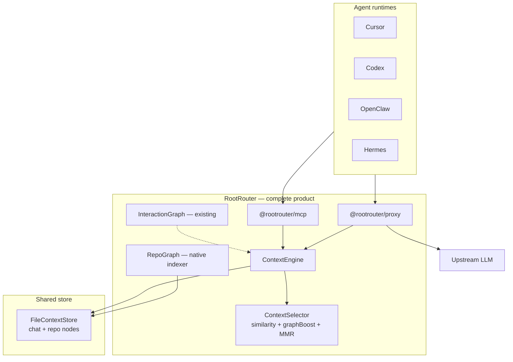

# RootRouter — Next Steps

Roadmap after `selectContext`, MCP, and the transparent proxy. RootRouter is a **complete standalone product**: native repo knowledge graph, unified runtime memory, and transparent token budgeting — inspired by fundamentals from tools like [Graphify](https://graphify.net/), but **no Graphify dependency**.

---

## Product vision (end state)

When all phases are complete, an agent developer:

1. Points `base_url` at `rootrouter-proxy` (or adds MCP for explicit control).
2. Runs `rootrouter index ./repo` once per codebase (optional but recommended for coding agents).
3. Never thinks about prompt stuffing again.

RootRouter automatically:

- Trims live chat history every LLM call (proxy).
- Recalls relevant prior turns across sessions (stateful store).
- Pulls relevant **files and symbols** from a native **RepoGraph** (not external tools).
- Enforces a token budget with MMR dedup.
- Optionally logs savings to telemetry / dashboard.



**North star:** sessions that would send 50k+ tokens routinely send 5–15k of *relevant* context — repo structure + conversation — with **only** a `base_url` change.

**Refined (Insight 007):** agents should fail in **seconds** with **actionable** errors, and succeed with fewer tokens, without the operator learning Docker networking, gzip, and provider key tiers. See [Insight 007 — OpenClaw VPS agent UX](./insights/007-openclaw-vps-agent-ux-lessons.md).

---

## Where we are now

| Surface | What it does | Agent awareness |
|---------|----------------|-----------------|
| `selectContext` / `ContextEngine` | Query-aware similarity + MMR within a token budget | Code import |
| `@rootrouter/mcp` | `record_context`, `select_context`, `index_repo`, `stats`, `list_selections` over a file-backed store + `selections.jsonl` audit | Agent must call tools |
| `@rootrouter/proxy` | Trims `messages[]` on every `/chat/completions` before upstream | **None** (transparent) |

**Main gap (P0):** ~~the proxy is stateless per request~~ — **resolved** (stateful proxy, Phase 1).

**Secondary gap (P2):** ~~no native repo structure graph~~ — **resolved** (RepoGraph, Phase 2).

---

## Graphify — design reference only

[Graphify](https://graphify.net/) is useful **research**, not a dependency. It validates the market (71.5× token reduction on subgraph vs naive corpus for repo queries) and teaches patterns we model natively:

| Graphify fundamental | RootRouter native equivalent |
|---------------------|------------------------------|
| Static repo graph (AST, imports) | **`RepoGraph`** — Phase 2 |
| Leiden communities | Community tags on nodes + MMR diversity (start with directory/components) |
| God nodes / hub symbols | `degree` boost in `graphBoost` |
| BFS subgraph query | Seed by similarity → expand 1–2 hops via `metadata.edges` |
| Cached semantic summaries | Optional per-file summary on index (no raw code in embed API) |
| Incremental cache / watch | File watcher → re-chunk → upsert store |
| Secure ingest | Path containment, max file size on `index_repo` |

**We do not:** ship Graphify, require `pip install graphifyy`, or import `graph.json` as the primary path (optional interoperability later).

### Three graph layers (RootRouter moat)

| Layer | Module | Domain |
|-------|--------|--------|
| **RepoGraph** (new) | `packages/sdk/src/repo/` | What the codebase **is** — files, symbols, imports |
| **InteractionGraph** (existing) | `packages/sdk/src/core/graph.ts` | What agents **did** — turns, topics, chambers |
| **AgentTopologyGraph** (existing) | `packages/sdk/src/core/agentGraph.ts` | How agents **delegate** |

Only RootRouter unifies all three under one `ContextEngine` store and one selection budget per LLM call.

---

## Phase 1 — Stateful proxy (P0) ← **in progress**

**Goal:** Proxy remembers context across requests without the agent calling MCP tools.

### 1.1 Shared `ContextEngine` in the proxy process

- [x] Hold a `FileContextStore` in the proxy (env: `ROOTROUTER_STORE_PATH`).
- [x] On each `/chat/completions`, upsert prior `user`/`assistant` string turns into the store.
- [x] Merge **stored** candidates with in-request turns; select with split budget (`ROOTROUTER_STORE_SHARE`, default 0.5).
- [x] Inject selected store turns into the prompt (not only filter in-request).
- [x] `x-rootrouter-agent-id` header for multi-agent scoping.
- [x] Persist store after each request.

### 1.2 Prompt assembly policy

- [x] Always keep: system, tool, multimodal, final user turn.
- [x] Middle: selected mix of in-request history + store hits, sorted by time/index.
- [x] Store vs in-request budget split (default 50/50 of `contextBudget`).

### 1.3 Tests

- [x] Unit: stateful filter retrieves store context when request is short.
- [x] E2E: two-request session; request 2 recalls relevant turn from request 1.
- [x] E2E: `x-rootrouter-agent-id` isolation.

**Outcome:** True "walk away" UX for chat-heavy agents — proxy only, no MCP discipline required.

---

## Phase 2 — Native RepoGraph (repo-aware context)

**Goal:** Coding agents get structural context from a **built-in indexer** — complete product, no Graphify.

### 2.1 `RepoGraph` module (`packages/sdk/src/repo/`)

- [x] `indexRepo(rootPath, options)` — walk repo, chunk files, extract edges.
- [x] **MVP edges:** `imports` (TS/JS/Python import parsing), `same_directory`.
- [x] **MVP nodes:** file chunks as `ContextItem` with `metadata: { path, language, edges[], community?, degree? }`.
- [x] Communities: directory-based (Leiden later if needed).
- [x] Hub detection: degree centrality → `metadata.degree` for god-node boost.
- [x] Security: path containment (jail to repo root), max file size, ignore `node_modules`/`.git`.

### 2.2 Ingest surfaces

- [x] CLI: `rootrouter index ./repo` (or `npm run index -w rootrouter -- ./path`).
- [x] MCP tool: `index_repo` → upsert into shared store.
- [x] Proxy env: `ROOTROUTER_REPO_PATH` → auto-index on startup (optional).

### 2.3 `graphBoost` in `ContextSelector`

- [x] Seed: top-k items by query similarity.
- [x] Expand: 1-hop neighbors via `metadata.edges`.
- [x] Boost: hub nodes + expanded neighbors (same pattern as `chamberBoost`).
- [x] Community cap: prefer at most N items per `metadata.community` in MMR pass.

### 2.4 Bridge runtime ↔ repo (RootRouter-only)

- [x] When proxy records a turn, tag `metadata.filesMentioned` if paths appear in text.
- [ ] Strengthen `turn → file` edges in store metadata over time.
- [ ] Optional: chamber id from `InteractionGraph` boosts repo nodes in same chamber region.

**Outcome:** `npm install rootrouter` + `index` + `proxy` = full coding-agent context stack.

### 2.5 Deferred (not MVP)

- Call graph via Tree-sitter / `ts-morph`.
- PDF, diagram, vision ingest.
- Leiden clustering in TypeScript.
- Optional **Graphify import adapter** for users who already have `graph.json` (interop only).

---

## Phase 3 — Selection quality and scale

### 3.1 Embeddings

- [x] Embedding cache (content-hash keyed) in `ContextEngine` / proxy.
- [x] Optional local model provider (ONNX `bge-small` / MiniLM) behind `EmbeddingProvider`.
- [x] Wire `EMBEDDING_API_KEY` in proxy (parity with MCP).

### 3.2 Indexing

- [x] ANN index (HNSW) when `store.size > N` (e.g. 500).
- [x] Eviction: LRU by last-selected timestamp beyond `maxItems`.

### 3.3 Honest metrics

- [x] Recall proxy: log dropped message ids; optional thumbs-down hook.
- [x] Realistic savings baseline (window of last N turns, not lifetime store).

---

## Phase 4 — Packaging and agentic UX

### 4.1 npm surface

- [x] Publish prep: `repository`, `publishConfig`, `prepublishOnly`, `npm run publish:packages` (see [`docs/PUBLISH.md`](PUBLISH.md)).
- [x] One-liner (after npm publish):
  ```bash
  npm install rootrouter@beta @rootrouter/proxy@beta @rootrouter/mcp@beta
  npx rootrouter@beta index ./my-repo
  npx -p @rootrouter/proxy@beta rootrouter-proxy
  npx -p @rootrouter/mcp@beta rootrouter-mcp
  ```

### 4.2 Agent presets

- [x] `rootrouter init cursor` — `.cursor/mcp.json` + proxy env snippet.
- [x] `rootrouter init codex` — `~/.codex/config.toml` fragment.
- [x] `rootrouter init hermes` — `~/.hermes/config.yaml` → proxy + `x-rootrouter-agent-id: hermes-coo:<slug>` (persona store).
- [ ] `rootrouter init openclaw` — same persona+project header pattern (`openclaw-shamy:<slug>`).

### 4.3 Dashboard

- [x] `selectionStats` in Convex snapshots (`buildSelectionSnapshot`, `rootrouter snapshot`, demos with `ROOTROUTER_STORE_PATH`).
- [x] Topology view: RepoGraph communities + import overlay graph.

---

## Phase 5 — Agent deploy hardening (P0 / P1) ← **next batch**

**Goal:** Make the real-world agent path work — OpenClaw-in-Docker, Venice, reverse proxy, streaming — without operator archaeology.  
**Insight driver:** [007 — OpenClaw VPS agent UX](./insights/007-openclaw-vps-agent-ux-lessons.md) (Shamy production deploy, 2026-07-01).  
**Effort:** Medium · **Impact:** High · **Target:** next production batch after insight capture.

### 5.0 Agent playbook — Layer 1 (ethskills pattern)

**Goal:** One fetchable URL so agents know what RootRouter is without mounting the monorepo.

- [x] Ship [`docs/SKILL.md`](./SKILL.md) + [`apps/dashboard/public/SKILL.md`](../apps/dashboard/public/SKILL.md) → `https://rootrouter.motusdao.org/SKILL.md` on VPS.
- [x] Playbook snippet template [`docs/templates/agent-playbook-snippet.md`](./templates/agent-playbook-snippet.md).
- [x] Shamy `AGENTS.md` on VPS — fetch instruction prepended.
- [ ] Dashboard deploy to Vercel (user push) — verify live URL returns `text/plain` or `text/markdown`.
- [ ] `rootrouter init openclaw` — merge playbook line into workspace `AGENTS.md` automatically.
- [ ] Optional sub-skills: `openclaw/SKILL.md`, `proxy/SKILL.md` on same host (P2).

**Acceptance:** New OpenClaw chat asked “what is RootRouter?” → agent fetches SKILL.md → correct answer (not network router).

### 5.1 Proxy streaming reliability (P0)

**Problem:** OpenClaw (and most OpenAI clients) default to `stream: true`. Node `fetch` auto-decompresses gzip but forwarded `content-encoding: gzip` → clients see `terminated` / “LLM request timed out” while the UI shows “in progress.”

- [x] **Runtime fix:** upstream `accept-encoding: identity`; strip `content-encoding` on proxied responses (`packages/proxy/src/server.ts`).
- [ ] **E2E test:** fake upstream returns `stream: true` + gzip body; assert client receives valid SSE chunks (no `Z_DATA_ERROR`).
- [ ] **E2E test:** Venice or OpenRouter-shaped stream through full proxy process (`test/e2e-stream.mjs` or extend `test/e2e.mjs`).
- [ ] **Regression gate:** add stream case to `npm run test -w @rootrouter/proxy` / CI.
- [ ] **Docs:** proxy README — “Streaming” section notes gzip handling and OpenClaw compatibility.

**Acceptance:** `curl -N` with `stream:true` through proxy returns parseable `data:` lines; OpenClaw dashboard chat completes without 5s timeout.

### 5.2 Distribution — npm or official source deploy (P0)

**Problem:** `npx -p @rootrouter/proxy@beta rootrouter-proxy` 404’d on VPS; private repo forced rsync + `npm run build:all`.

- [ ] **Option A (preferred):** publish `@rootrouter/proxy@beta` + `rootrouter@beta` + `@rootrouter/mcp@beta` via `npm run publish:packages` (resolve `@rootrouter` scope / `rootrouter` package ownership on npm).
- [ ] **Option B (parallel):** document **source deploy** as first-class in [`docs/PUBLISH.md`](PUBLISH.md) and [`docs/deployment-matrix.md`](deployment-matrix.md):
  - rsync or deploy-key clone → `npm install` → `npm run build:all`
  - run `node packages/proxy/dist/server.js` or sidecar compose (5.3)
- [ ] Update root README + proxy README one-liners to show both paths (`npx` when published, `docker compose` / source when not).
- [ ] `rootrouter doctor` warns when `npx -p @rootrouter/proxy` is not resolvable and prints source-deploy fallback.

**Acceptance:** fresh VPS operator can deploy proxy in &lt;15 minutes following one doc path without hitting undocumented 404.

### 5.3 OpenClaw + Venice sidecar template (P1)

**Problem:** Host `127.0.0.1:8787` / `172.17.0.1` unreachable from agent containers; port 8787 may collide (`openclaw-bridge`); Caddy needs shared Docker network.

- [ ] Ship **`docker-compose.proxy.yml`** at repo root (or `docs/templates/`) — `rootrouter-proxy` on external network `openclaw_default` (or parameterized).
- [ ] Harden **`scripts/setup-openclaw-venice-shamy.sh`**:
  - [ ] Detect `OPENCLAW_CONFIG_DIR` / `apps/shamy` vs `~/.openclaw` layouts.
  - [ ] Patch compose: `VENICE_API_KEY` in `openclaw-gateway` + `openclaw-cli` `environment:`.
  - [ ] Attach gateway to Caddy network (`openclaw_default`) + document in script output.
  - [ ] Set `models.providers.rootrouter.baseUrl` to `http://rootrouter-proxy:8797/api/v1` (Docker DNS, not host IP).
  - [ ] Per-agent model split: Shamy → `rootrouter/*`, Avril/main → `venice/*` direct.
- [ ] Add **`docs/providers/openclaw-docker.md`** — sidecar pattern, network diagram, Caddy snippet, token/dashboard URL.
- [ ] Cross-link from [`deployment-matrix.md`](deployment-matrix.md) OpenClaw row.

**Acceptance:** re-run setup script on clean Shamy-style VPS → dashboard connects, chat reaches Venice through proxy.

### 5.4 `rootrouter doctor --docker` (P1)

**Problem:** failures looked like agent bugs; no single diagnostic covered port, network, stream, and secrets.

- [ ] **`doctor` subcommand flags:** `--docker`, optional `--proxy-url`, `--agent-container` (e.g. `shamy-openclaw-gateway-1`).
- [ ] **Port check:** `PORT` / 8787 / 8797 listening; warn if occupied by non-RootRouter process (heuristic: `/healthz` body lacks `"upstream"`).
- [ ] **Reachability:** from host `curl /healthz`; optional `docker exec` into agent container → proxy URL (same check OpenClaw uses).
- [ ] **Stream smoke:** POST `stream:true` minimal chat; fail if body empty or throws within 10s.
- [ ] **Secrets hint:** if `VENICE_API_KEY` in `.env` but not in `docker inspect` container env → print fix (`environment:` block).
- [ ] **Docker networking hint:** if host IP fails but service DNS works → recommend sidecar pattern (link 5.3).

**Acceptance:** `npx rootrouter@beta doctor --docker` prints pass/fail per check with copy-paste fixes (no silent failures).

### 5.5 Deferred from 007 (P2 / P3 — track, not this batch)

- [ ] **P2:** Proxy error classification headers (`x-rootrouter-upstream-status`, `x-rootrouter-error-class`) for agent failover messages.
- [ ] **P2:** `init` / setup output: “If agent runs in Docker, use service DNS not `127.0.0.1`.”
- [ ] **P3:** Dashboard topology edge: agent → `rootrouter-proxy` → upstream provider (Motus swarm demo).

---

## Execution order

| Priority | Work item | Agent UX impact |
|----------|-----------|-----------------|
| **P0** | Stateful proxy (Phase 1) | Highest — zero agent changes — **done** |
| **P0** | Proxy streaming + gzip e2e (Phase 5.1) | Fixes “stuck in progress” on OpenClaw — **fix shipped, tests pending** |
| **P0** | npm publish or official source-deploy (Phase 5.2) | First command on VPS must not 404 |
| **P1** | OpenClaw sidecar compose + setup script (Phase 5.3) | Repeatable Motus / VPS path |
| **P1** | `doctor --docker` (Phase 5.4) | Actionable failures vs agent blame |
| **P1** | Embedding cache + proxy env parity (Phase 3) | Better relevance — **done** |
| **P2** | Native RepoGraph + graphBoost (Phase 2) | Coding-agent quality — **done (MVP)** |
| **P2** | Proxy error headers + init Docker hints (Phase 5.5) | Clearer failover |
| **P3** | ANN index + recall metrics (Phase 3) | Scale + trust — **done** |
| **P3** | Dashboard deploy topology (Phase 5.5) | Devrel / swarm story |
| **P4** | `rootrouter init` + publish (Phase 4) | Distribution — **partial (init done; npm publish blocked)** |

---

## Decision log

| Question | Decision |
|----------|----------|
| Use Graphify at runtime? | **No** — design reference only |
| Build native repo knowledge graph? | **Yes** — `RepoGraph` in Phase 2 |
| Model Graphify concepts into RootRouter? | **Yes** — subgraph boost, hubs, communities, secure ingest |
| Quote Graphify CLI/MCP? | **No** (optional `graph.json` import later for interop) |
| Replace InteractionGraph with RepoGraph? | **No** — complementary layers |
| Proxy vs MCP primary? | **Proxy primary**; MCP for explicit control + `index_repo` |

---

## Open questions

1. **RepoGraph MVP languages** — TS/JS first, then Python? Confirm before Phase 2.
2. **Auto-index on proxy start** — `ROOTROUTER_REPO_PATH` vs explicit `index` command.
3. **Celo telemetry for selection** — on-chain `tokensSaved` from proxy, or off-chain only for v0.2?
4. **Monorepo publish** — single `rootrouter` meta-package vs separate scoped packages.

---

## References

- [Insight 007 — OpenClaw VPS agent UX](./insights/007-openclaw-vps-agent-ux-lessons.md)
- [Deployment matrix](./deployment-matrix.md)
- [Graphify](https://graphify.net/) — design reference (not a dependency)
- RootRouter MCP: [`packages/mcp/README.md`](../packages/mcp/README.md)
- RootRouter proxy: [`packages/proxy/README.md`](../packages/proxy/README.md)
- Interaction graph: [`packages/sdk/src/core/graph.ts`](../packages/sdk/src/core/graph.ts)
